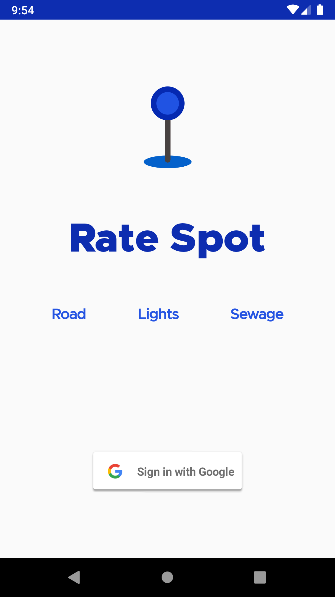
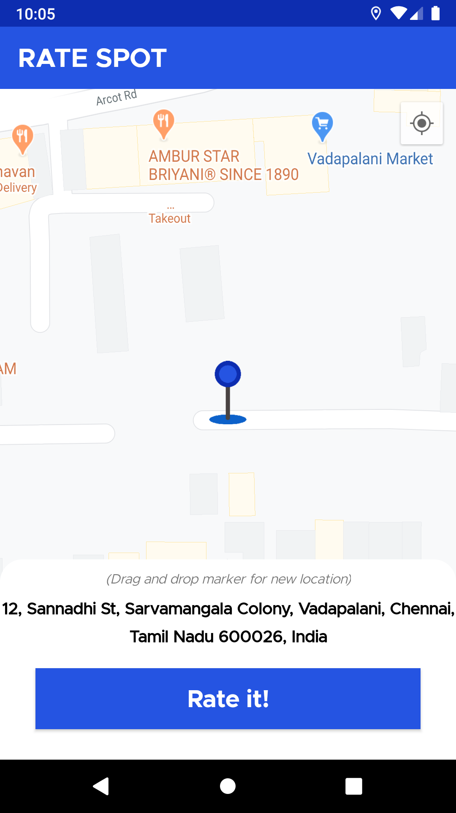
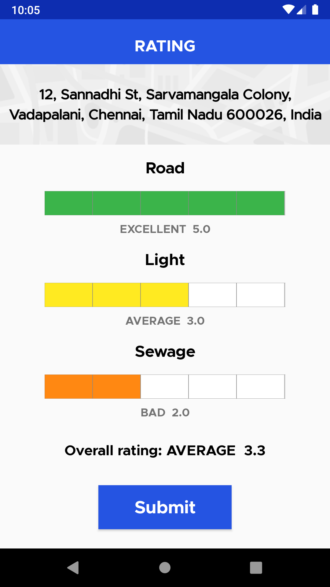

# RateSpot - Android App 

An android application to spot and rate road, street & seweage systems in your nearby location

Built part of learning Koltin with [#30DaysOfKotlin](#30DaysOfKotlin) campaign

## About

RateSpot - This android application allows you to spot and rate your nearby basic services like Road, Street lights, Sewage system.
User can easily marke their location from Google map and review services around between one to five.

## Concepts used

The android app build using follwoing concepts:
- Sing up/in using Google account
- Google map with custom markers
- Custom rating view status indicator.
- Firebase CloudStore for real-time updates.
- Fused location service to get current location.
- Live data & View Model.
- Constraint Layout.

## Screenshots

<table style="width:100%">
  <tr>
    <td></td>
    <td></td>
    <td>
  </tr>
   <tr>
    <th>Login</th>
    <th>Location on Map</th>
    <th>Custom Rating View</th>
  </tr>
</table>

## License

MIT License -
Copyright (c) 2020 Prabakaran Marimuthu

